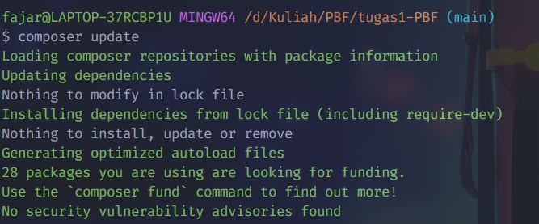
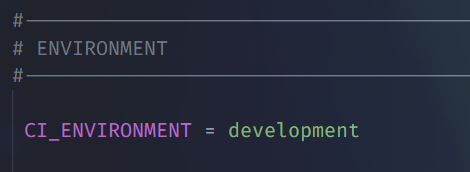

# Panduan dalam menggunakan CodeIgniter4

## Apa Itu CodeIgniter?

CodeIgniter merupakan sebuah full-stack web framework yang berbasis PHP.

untuk informasi lebih lanjut dapat mengunjungi [official site](https://codeigniter.com).

Kita dapat membuka laman [user guide](https://codeigniter.com/user_guide/)
untuk mengetahui update CodeIgniter lebih lanjut.
<br><br>

## Instalasi dan Update
Untuk melakukan instalasi project ci kita dapat mengetikan perintah berikut pada command prompt
```bash
composer create-project codeigniter4/appstarter project-root
```
maka akan secara otomatis terbuat folder project-root, kita dapat mengganti `project_root` dengan nama sesuka kita.

Selanjutnya kita dapat mengetikan perintah berikut pada project kita
```bash
composer update
```
Untuk melakukan pengecekan apakah CodeIgniter terdapat update, 

jika tidak ada update akan muncul seperti ini :



## Menjalankan Aplikasi
Sebelum kita menjalankan aplikasi nya kita dapat melakukan beberapa konfigurasi terlebih dahulu, kita dapat melakukan beberapa konfigurasi ini pada file `env`,
jangan lupa untuk rename file menjadi `.env`

### 1.Set aplikasi ke development mode

kita ubah ci environment pada file `.env` dari production menjadi development.
Dikarenakan pada development terdapat beberapa kelebihan salah satu nya adalah fitur debugging dan error handling.

### 2.Set aplikasi ke development mode

kita ubah ci environment pada file `.env` dari production menjadi development.
Dikarenakan pada development terdapat beberapa kelebihan salah satu nya adalah fitur debugging dan error handling.

### 1.Set aplikasi ke development mode

kita ubah ci environment pada file `.env` dari production menjadi development.
Dikarenakan pada development terdapat beberapa kelebihan salah satu nya adalah fitur debugging dan error handling.


## Important Change with index.php

`index.php` is no longer in the root of the project! It has been moved inside the *public* folder,
for better security and separation of components.

This means that you should configure your web server to "point" to your project's *public* folder, and
not to the project root. A better practice would be to configure a virtual host to point there. A poor practice would be to point your web server to the project root and expect to enter *public/...*, as the rest of your logic and the
framework are exposed.

**Please** read the user guide for a better explanation of how CI4 works!

## Repository Management

We use GitHub issues, in our main repository, to track **BUGS** and to track approved **DEVELOPMENT** work packages.
We use our [forum](http://forum.codeigniter.com) to provide SUPPORT and to discuss
FEATURE REQUESTS.

This repository is a "distribution" one, built by our release preparation script.
Problems with it can be raised on our forum, or as issues in the main repository.

## Server Requirements

PHP version 7.4 or higher is required, with the following extensions installed:

- [intl](http://php.net/manual/en/intl.requirements.php)
- [mbstring](http://php.net/manual/en/mbstring.installation.php)

> [!WARNING]
> The end of life date for PHP 7.4 was November 28, 2022.
> The end of life date for PHP 8.0 was November 26, 2023.
> If you are still using PHP 7.4 or 8.0, you should upgrade immediately.
> The end of life date for PHP 8.1 will be November 25, 2024.

Additionally, make sure that the following extensions are enabled in your PHP:

- json (enabled by default - don't turn it off)
- [mysqlnd](http://php.net/manual/en/mysqlnd.install.php) if you plan to use MySQL
- [libcurl](http://php.net/manual/en/curl.requirements.php) if you plan to use the HTTP\CURLRequest library
