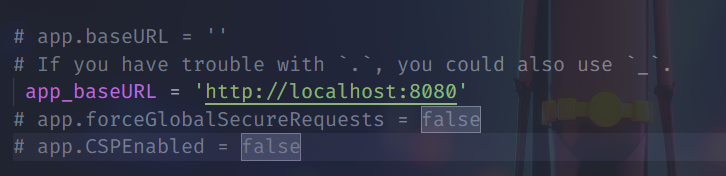
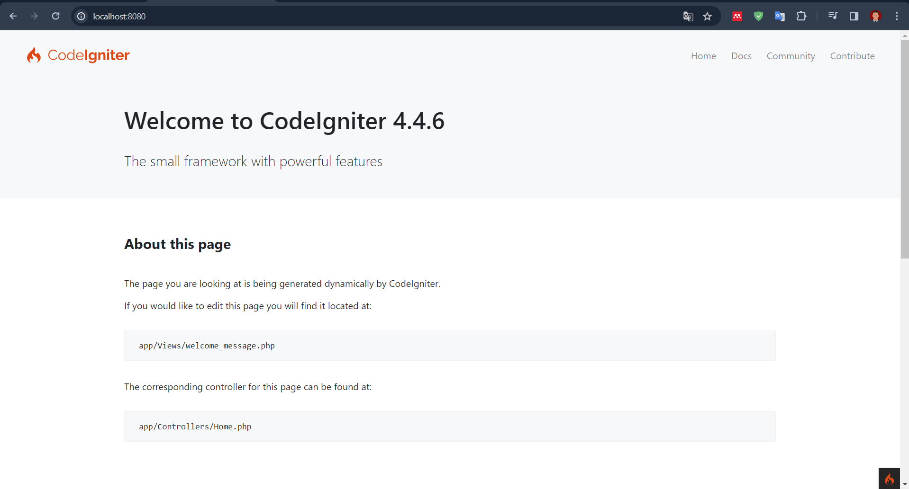
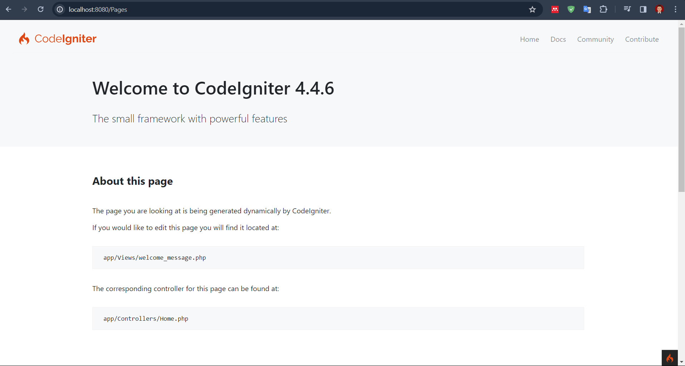
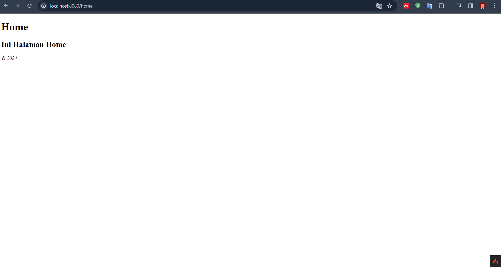
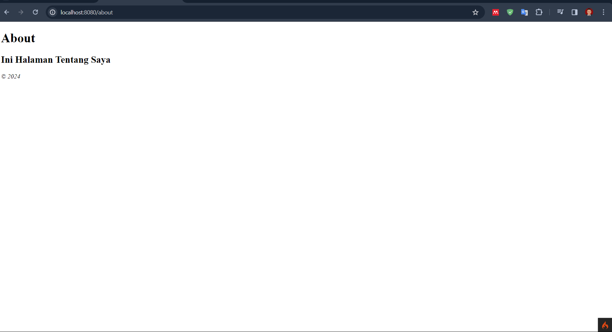
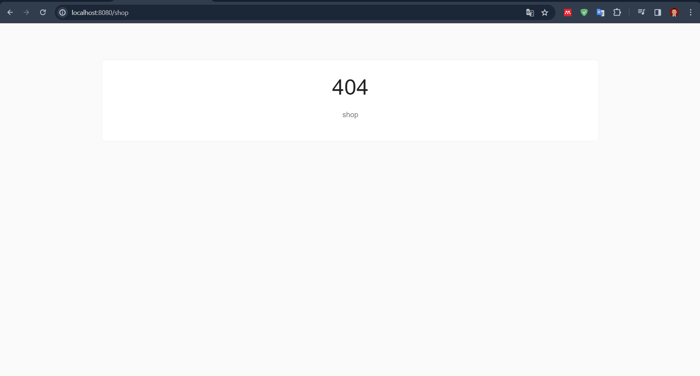
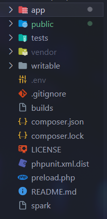
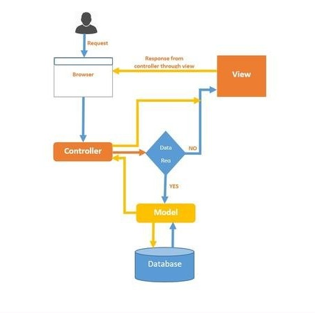

# Panduan dalam menggunakan CodeIgniter4

## A. Apa Itu CodeIgniter?

CodeIgniter merupakan sebuah full-stack web framework yang berbasis PHP.

untuk informasi lebih lanjut dapat mengunjungi [official site](https://codeigniter.com).

Kita dapat membuka laman [user guide](https://codeigniter.com/user_guide/)
untuk mengetahui update CodeIgniter lebih lanjut.
<br><br>

## B. Instalasi dan Update
Untuk melakukan instalasi project ci kita dapat mengetikan perintah berikut pada command prompt
```
composer create-project codeigniter4/appstarter project-root
```
maka akan secara otomatis terbuat folder project-root, kita dapat mengganti `project_root` dengan nama sesuka kita.

Selanjutnya kita dapat mengetikan perintah berikut pada project kita
```
composer update
```
Untuk melakukan pengecekan apakah CodeIgniter terdapat update, 

jika tidak ada update akan muncul seperti ini :


## C. Menjalankan Aplikasi
Sebelum kita menjalankan aplikasi nya kita dapat melakukan beberapa konfigurasi terlebih dahulu, kita dapat melakukan beberapa konfigurasi ini pada file `env`,
jangan lupa untuk rename file menjadi `.env` 

### 1.Set aplikasi ke development mode


kita ubah ci environment pada file `.env` dari production menjadi development.
Dikarenakan pada development terdapat beberapa kelebihan salah satu nya adalah fitur debugging dan error handling.

### 2.Set Base URL


kita dapat mengubah nama default dari base url kita disini saya ganti dengan `http://localhost:8080`.


### 3.Set database 


Disini kita dapat mengatur database yang akan kita gunakan pada aplikasi kita.


Konfigurasi Awal selesai, untuk menjalankan aplikasi kita dapat mengetikan perintah 
```
php spark serve
```

## D. Halaman Statis
### 1.Setting Routing Rules
Routing adalah proses menentukan arah atau rute yang harus dilalui. Pada framework CI4, routing bertujuan untuk menentukan Controller mana yang harus merespon sebuah request.

Mari kita setting routes rules. Buka file routes yang ada di `app/Config/Routes.php.`

Maka akan muncul kode seperti berikut
```shell
<?php

use CodeIgniter\Router\RouteCollection;

/**
 * @var RouteCollection $routes
 */
$routes->get('/', 'Home::index');
```
Selanjutnya kita dapat menambahkan routes berikut ini
```shell
use App\Controllers\Pages;

$routes->get('pages', [Pages::class, 'index']);
$routes->get('(:segment)', [Pages::class, 'view']);
```
- Routes kedua berfungsi ketika kita melakukan GET URI(Mengetikan URL) /pages yang kemudian akan diarahkan ke Controller Pages Method Index.
- Untuk Routes ketiga berfungsi ketika kita melakukan GET URI dengan placeholder `(:segment)` yang akan diteruskan ke Controller Pages Method view.

### 2.Membuat Pages Controller
Kita sudah menambahkan routes ke controller pages sedangkan kita belum punya controller pages. Oleh karena itu, mari kita buat controller pages nya dengan cara ;
1. Masuk menu Controller
2. klik kanan pada menu controller, pilih new file
3. ketikan nama Pages.php

Setelah itu masuk pada file Pages.php (Controller Page) lalu ketikan perintah berikut :
```shell
<?php

namespace App\Controllers;

class Pages extends BaseController
{
    public function index()
    {
        return view('welcome_message');
    }

    public function view($page = 'home')
    {
        // ...
    }
}
```

Kita telah membuat kelas bernama Pages, dengan view()metode yang menerima satu parameter bernama `$page`. kelas Pages juga memiliki `index() methods,` sama dengan controller default yang ditemukan di `app/Controllers/Home.php ;` metode itu menampilkan halaman selamat datang CodeIgniter.

### 3. Membuat Views
Kita akan membuat 2 buah views yang akan kita letakkan pada `Apps/Views/templates` yaitu ;
1. header.php
untuk file header akan kita isi dengan kode berikut :
```shell
<!doctype html>
<html>
<head>
    <title>Tutorial CI4</title>
</head>
<body>

    <h1><?= esc($judul) ?></h1>
```
pada file ini terdapat variabel `$judul` yang akan kita definisikan nanti.
   
2. footer.php
untuk footer kita isi dengan kode berikut :
```shell
    <em>&copy; 2024</em>
</body>
</html>
```

### 4. Menambahkan Logika ke Controller
#### Membuat home.php & about.php
Sebelumnya kita telah membuat method `views()` yang menerima parameter yang dimana akan menjadi nama dari halaman kita. 
static page bodies akan kita letakkan di `app/Views/pages directory.`. jadi kita membuat folder baru lagi pada folder views.

#### Finishing Controller Pages
Supaya kita dapat load file `home.php` dan `about.php` yang sudah kita buat, kita perlu menambahkan kode berikut pada controller pages method view
```shell
<?php

namespace App\Controllers;

use CodeIgniter\Exceptions\PageNotFoundException; // Add this line

class Pages extends BaseController
{
    // ...

    public function view($page = 'home')
    {
        if (! is_file(APPPATH . 'Views/pages/' . $page . '.php')) {
            // Whoops, we don't have a page for that!
            throw new PageNotFoundException($page);
        }

        $data['judul'] = ucfirst($page); // Mengkapitalisasi Huruf Pertama
        return view('templates/header', $data)
            . view('pages/' . $page)
            . view('templates/footer');
    }
}
```

Sekarang, ketika halaman yang diminta memang ada, halaman tersebut dimuat, termasuk header dan footer, dan dikembalikan ke pengguna. Jika controller mengembalikan nilai string, string tersebut akan ditampilkan kepada pengguna. Jika halaman yang diminta tidak ada, kesalahan “Halaman 404 tidak ditemukan” akan ditampilkan.

### 5. Menjalankan Aplikasi
Untuk menjalankan aplikasi ketikan kode perintah berikut pada `project-root' kita.
```
php spark serve
```
kita dapat melakukan pengujian berikut :
- localhost:8080/
  
   
   
   "welcome page" CodeIgniter. hasil dari index()method di home controller.
- localhost:8080/pages
  
   
   
   "welcome page" CodeIgniter. hasil dari index()method di pages controller.
- localhost:8080/home
  
   
   
   tampilkan halaman “home” yang telah kita buat. Hasil dari views method Pages controller.
- localhost:8080/about
  
   
   
   tampilkan halaman “about” yang telah kita buat. Hasil dari views method Pages controller.
- localhost:8080/shop
  
   
   
   Menghasilkan errorr karena tidak ada file `app/views/pages/shop`


## E. News Section
Kita telah berhasil membuat halaman statis, mari kita coba untuk menambahkan dynamic content dan koneksi database.

### Membuat database
Untuk membuat database dapat kita buat secara manual dengan membuka phpmyadmin lalu buat database dengan nama `ci4tutorial`.
lalu ketikan query berikut pada MySQL
```shell
CREATE TABLE news (
    id INT UNSIGNED NOT NULL AUTO_INCREMENT,
    title VARCHAR(128) NOT NULL,
    slug VARCHAR(128) NOT NULL,
    body TEXT NOT NULL,
    PRIMARY KEY (id),
    UNIQUE slug (slug)
);
```
Selanjutnya kita melakukan query untuk memasukkan data kedalam tabel news
```shell
INSERT INTO news VALUES
(1,'Elvis sighted','elvis-sighted','Elvis was sighted at the Podunk internet cafe. It looked like he was writing a CodeIgniter app.'),
(2,'Say it isn\'t so!','say-it-isnt-so','Scientists conclude that some programmers have a sense of humor.'),
(3,'Caffeination, Yes!','caffeination-yes','World\'s largest coffee shop open onsite nested coffee shop for staff only.');
```

### Membuat Model News
kita telah membuat database dan tabel selanjutnya mari kita membuat model untuk menghubungkan database tersebut.

```shell
<?php

namespace App\Models;

use CodeIgniter\Model;

class NewsModel extends Model
{
    protected $table = 'news';
}
```

### Menambahkan method getNews() di News Model
database dan model sudah ter set, sekarang kita perlu sebuah method untuk mengambil semua post dari database untuk ditampilkan, untuk menangani masalah tersebut
kita dapat melakukan perintah berikut

```shell
 public function getNews($slug = false)
    {
        if ($slug === false) {
            return $this->findAll();
        }

        return $this->where(['slug' => $slug])->first();
    }
```

### Menambahkan Routing Rules
kita tambahkan beberapa kode pada `app\Config\Routes.php`, kita tambahkan kode berikut :

```shell
<?php

// ...

use App\Controllers\News; // Add this line
use App\Controllers\Pages;

$routes->get('news', [News::class, 'index']);           // Add this line
$routes->get('news/(:segment)', [News::class, 'show']); // Add this line

$routes->get('pages', [Pages::class, 'index']);
$routes->get('(:segment)', [Pages::class, 'view']);
```

dengan kode berikut maka dapat dipastikan kita memerlukan untuk membuat News controller dengan 2 method, index dan show.

###

## E. Struktur Aplikasi



Untuk mempelajari CodeIgniter kita perlu memahami dulu struktur aplikasi dari CodeIgniter.
Ci sendiri terdapat 5 buah direktori default yang masing - masing memiliki peran yang berbeda - beda, yaitu :
1. app
2. public
3. writeable
4. tests
5. vendor

### 1. app
Pada direktori app merupakan direktori utama pada aplikasi. karena pada direktori ini terdapat component-component penting, Seperti :
`Config/`, `Controller/`, `Models/`, `Views/`, dll.

### 2. Public
Direktori public dapat kita isi dengan asset-asset yang akan digunakan pada aplikasi kita, contohnya `images`, `javascript` dan `css`.

### 3. writeable
Pada direktori ini akan terisi secara otomatis oleh sistem, didalam nya berisi salah satu nya yaitu `cache`, `log`.

### 4. tests
Direktori yang di set untuk pengujian file.

### 5. Vendor
Direktori yang dapat digunakan untuk third party app, seperti `API`, `HTTP REQUEST`, dll.

## F. Model, View, Controller (MVC)



CodeIgniter menggunakan pola MVC untuk mengatur file - file yang ada didalamnya. Model, Views, Controller berada dalam direktori `app/`.
### Model
Model biasanya digunakan untuk menangani query ke database, termasuk CRUD.
### Views
Views merupakan tampilan yang menghubungkan pengguna dengan sistem, yang didalamnya biasanya diisi HTML dan CSS.
### Controller
Controller berisi logic dari aplikasi yang berguna untuk mengatur jalannya proses aplikasi


