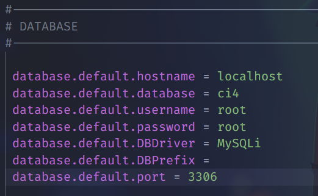

# Panduan dalam menggunakan CodeIgniter4

## Apa Itu CodeIgniter?

CodeIgniter merupakan sebuah full-stack web framework yang berbasis PHP.

untuk informasi lebih lanjut dapat mengunjungi [official site](https://codeigniter.com).

Kita dapat membuka laman [user guide](https://codeigniter.com/user_guide/)
untuk mengetahui update CodeIgniter lebih lanjut.
<br><br>

## Instalasi dan Update
Untuk melakukan instalasi project ci kita dapat mengetikan perintah berikut pada command prompt
```
composer create-project codeigniter4/appstarter project-root
```
maka akan secara otomatis terbuat folder project-root, kita dapat mengganti `project_root` dengan nama sesuka kita.

Selanjutnya kita dapat mengetikan perintah berikut pada project kita
```
composer update
```
Untuk melakukan pengecekan apakah CodeIgniter terdapat update, 

jika tidak ada update akan muncul seperti ini :


## Menjalankan Aplikasi
Sebelum kita menjalankan aplikasi nya kita dapat melakukan beberapa konfigurasi terlebih dahulu, kita dapat melakukan beberapa konfigurasi ini pada file `env`,
jangan lupa untuk rename file menjadi `.env` 

### 1.Set aplikasi ke development mode


kita ubah ci environment pada file `.env` dari production menjadi development.
Dikarenakan pada development terdapat beberapa kelebihan salah satu nya adalah fitur debugging dan error handling.

### 2.Set Base URL


kita dapat mengubah nama default dari base url kita disini saya ganti dengan `http://localhost:8080`.


### 3.Set database 


Disini kita dapat mengatur database yang akan kita gunakan pada aplikasi kita.


Konfigurasi Awal selesai, untuk menjalankan aplikasi kita dapat mengetikan perintah 
```
php spark serve
```

## Halaman Statis
### 1.Setting Routing Rules
Routing adalah proses menentukan arah atau rute yang harus dilalui. Pada framework CI4, routing bertujuan untuk menentukan Controller mana yang harus merespon sebuah request.

Mari kita setting routes rules. Buka file routes yang ada di `app/Config/Routes.php.`

Maka akan muncul kode seperti berikut
```shell
<?php

use CodeIgniter\Router\RouteCollection;

/**
 * @var RouteCollection $routes
 */
$routes->get('/', 'Home::index');
```
Selanjutnya kita dapat menambahkan routes berikut ini
```shell
use App\Controllers\Pages;

$routes->get('pages', [Pages::class, 'index']);
$routes->get('(:segment)', [Pages::class, 'view']);
```
- Routes kedua berfungsi ketika kita melakukan GET URI(Mengetikan URL) /pages yang kemudian akan diarahkan ke Controller Pages Method Index.
- Untuk Routes ketiga berfungsi ketika kita melakukan GET URI dengan placeholder `(:segment)` yang akan diteruskan ke Controller Pages Method view.

### 2.Membuat Pages Controller
Kita sudah menambahkan routes ke controller pages sedangkan kita belum punya controller pages. Oleh karena itu, mari kita buat controller pages nya dengan cara ;
1. Masuk menu Controller
2. klik kanan pada menu controller, pilih new file
3. ketikan nama Pages.php

Setelah itu masuk pada file Pages.php (Controller Page) lalu ketikan perintah berikut :
```shell
<?php

namespace App\Controllers;

class Pages extends BaseController
{
    public function index()
    {
        return view('welcome_message');
    }

    public function view($page = 'home')
    {
        // ...
    }
}
```

### 3. Membuat Views
Kita akan membuat 2 buah views yang akan kita letakkan pada `Apps/Views/templates` yaitu ;
1. header.php
untuk file header akan kita isi dengan kode berikut :
```shell
<!doctype html>
<html>
<head>
    <title>Tutorial CI4</title>
</head>
<body>

    <h1><?= esc($judul) ?></h1>
```
pada file ini terdapat variabel `$judul` yang akan kita definisikan nanti.
   
2. footer.php
untuk footer

Kita telah membuat kelas bernama Pages, dengan view()metode yang menerima satu parameter bernama `$page`. kelas Pages juga memiliki `index() methods,` sama dengan controller default yang ditemukan di `app/Controllers/Home.php ;` metode itu menampilkan halaman selamat datang CodeIgniter.

## Repository Management

We use GitHub issues, in our main repository, to track **BUGS** and to track approved **DEVELOPMENT** work packages.
We use our [forum](http://forum.codeigniter.com) to provide SUPPORT and to discuss
FEATURE REQUESTS.

This repository is a "distribution" one, built by our release preparation script.
Problems with it can be raised on our forum, or as issues in the main repository.

## Server Requirements

PHP version 7.4 or higher is required, with the following extensions installed:

- [intl](http://php.net/manual/en/intl.requirements.php)
- [mbstring](http://php.net/manual/en/mbstring.installation.php)

> [!WARNING]
> The end of life date for PHP 7.4 was November 28, 2022.
> The end of life date for PHP 8.0 was November 26, 2023.
> If you are still using PHP 7.4 or 8.0, you should upgrade immediately.
> The end of life date for PHP 8.1 will be November 25, 2024.

Additionally, make sure that the following extensions are enabled in your PHP:

- json (enabled by default - don't turn it off)
- [mysqlnd](http://php.net/manual/en/mysqlnd.install.php) if you plan to use MySQL
- [libcurl](http://php.net/manual/en/curl.requirements.php) if you plan to use the HTTP\CURLRequest library
